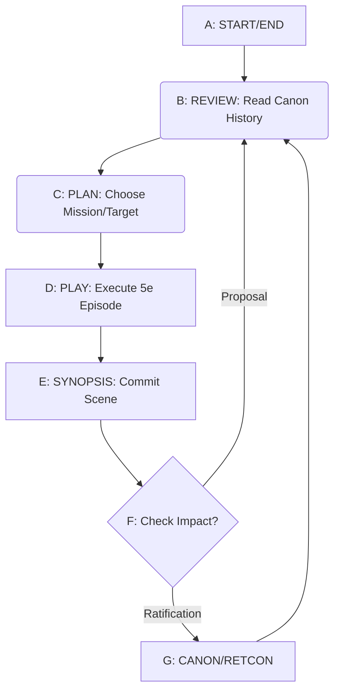
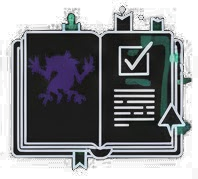
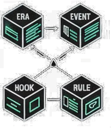
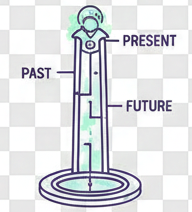
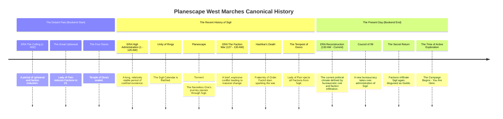

## Planescape West Marches Campaign Handbook (Draft)

Welcome to the **Planescape West Marches** campaign! This document serves as the single source of truth for our shared world, history, and structural rules, regardless of where this information is stored.

### Resource links

- [Everyday Reference - 5e.tools](https://5e.tools/)
- [Markdown Reference - srd.wiki](https://srd.wiki/)

---

##  Terms of Service (Table of Contents)

This campaign is a collaborative project. By participating, you agree to adhere to the rules and structures defined in the sections below.

- [Planescape West Marches Campaign Handbook (Proposed Format)](#planescape-west-marches-campaign-handbook-proposed-format)
- [ Terms of Service (Table of Contents)](#-terms-of-service-table-of-contents)
- [ Campaign Overview](#-campaign-overview)
- [ The Canonical Blocks (The Data)](#-the-canonical-blocks-the-data)
- [ Session Zero Cycle (Establishing Canon)](#-session-zero-cycle-establishing-canon)
- [ Post-Adventure Flow (Ratifying Results)](#-post-adventure-flow-ratifying-results)
- [ Required Documents and Categories](#-required-documents-and-categories)
- [ Campaign History Timeline](#-campaign-history-timeline)

---

##  Campaign Overview 

* **Setting:** The wild, infinite frontier of the Planescape multiverse, accessed via portals centered in **Sigil, the City of Doors**.
* **Style:** Player-driven, high-stakes exploration, and single-session adventures.
* **Structure:** Multiple DMs, flexible party compositions, and low player commitment.
* **History Engine:** A modified *Microscope* TTRPG system ensures all participants have equal authority in establishing **Canon** (shared facts).

---

##  The Canonical Blocks (The Data)

Canonical Blocks are the definitive units of information for our campaign. They must be stored in the **Shared Canon Archive**.

| Block Name | Purpose | Storage Location Label |
| :--- | :--- | :--- |
| **Era** | Broad epochs of history, setting the stage for decades or centuries. | **History: Eras** (`Canonical_Blocks/History/Eras.md`) |
| **Canonical Event** | Specific, resolved incidents from the past. **Fact.** | **History: Events** (`Canonical_Blocks/History/Events.md`) |
| **Open Question/Hook** | Specific, unresolved mystery that **must be answered by an adventure**. | **Active Hooks** (`Open_Hooks/`) |
| **Canonical Rule** | Defines a campaign mechanic, premise, or constraint. | **Rules & Palette** (`Canonical_Blocks/Rules/`) |

---

##  Session Zero Cycle (Establishing Canon)

Session Zero is run without a GM, using the **Architect** role to collaboratively define the world and rules.

1.  **Define Palette & Banned List:** The group establishes the constraints and tone. These are recorded as **Canonical Rules**.
2.  **Define History Bookends:** The group sets a **Start Period** (a distant past event) and the **End Period** (The start of active play). These are recorded as **Eras**.
3.  **Architect's Turn:** The designated **Architect** chooses a Session Zero goal and proposes **one** new Canonical Block.
4.  **Ratification:** The group briefly discusses, then votes. If accepted, the Block is added to the **Shared Canon Archive** under the appropriate label.
5.  **New Architect:** The role passes to the next player.

The goal is to generate a robust timeline and several starting **Open Question/Hooks** for the campaign to begin.

---

##  Post-Adventure Flow (Ratifying Results)

This process defines how D&D adventures resolve **Open Questions** and create new **Canonical Events**.

1.  **Adventure Selection:** A DM chooses an active **Open Question/Hook** from the **Active Hooks** location.
2.  **The Adventure:** The party explores the question in a session. **Players in a party do not assume prior knowledge or a relationship with each other, unless explicitly established and agreed upon before the session begins.**
3.  **Ratification Submission:** When the party returns, the DM (or a nominated player) drafts the **Adventure Log** and submits it to the designated discussion channel.
4.  **Creation of New Canon:** After a brief review period, the log is formalized:
    * The original **Open Question/Hook** document is moved to the **Closed Hooks Archive** (`Closed_Hooks/`).
    * The **Canonical Event** described in the log is officially added to the **History: Events** list.
5.  **New Hooks Emerge:** Any **New Open Question/Hook** proposed in the log is added to the **Active Hooks** list.

---

##  Required Documents and Categories

The following categories of information are stored in the GitHub repo:

| Category Label | Location |
| :--- | :--- |
| **History: Eras** | `Canonical_Blocks/History/Eras.md` |
| **History: Events** | `Canonical_Blocks/History/Events.md` |
| **Rules & Palette** | `Canonical_Blocks/Rules/` |
| **Active Hooks** | `Open_Hooks/` |
| **Adventure Logs** | `Adventures/` |
| **Closed Hooks Archive** | `Closed_Hooks/` |

---

##  Campaign History Timeline

This timeline will be updated continuously as adventures resolve **Open Questions** and create **Canonical Events**.

